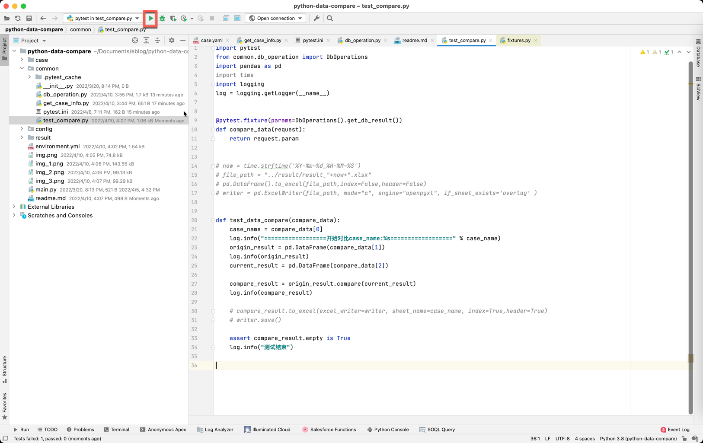

### 1.安装anaconda
https://blog.51cto.com/u_7174760/4027187
(安装好就行，不用创建env)

### 2.使用anaconda安装依赖：
使用pycharm打开项目

cd python-data-compare

conda env create -f environment.yaml

## 3.修改数据库配置（企业微信联系）
## 4.为test_compare.py配置pytest运行

## 5.选择pytest运行test_data_compare.py

